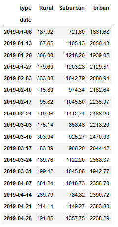

# PyBer Analysis Report
Resources used: Python, pandas, Jupyter Notebook, MatPlotLib, NumPy, and SciPy
## Overview of the Analysis
This project was given to me by a ride-sharing company called PyBer. The overall purpose of the project was to analyze the PyBer data to find the average fares per driver and ride, total number of available drivers and rides, and more. All of the analysis was sorted into "bins" based on the city type. The three different city types in this study were rural, suburban, and urban cities. Throughout the project, I was able to compare and contrast the sorted data between the city types to create tables and graphs. My last assignment in this project, which is what is shown below, was to create a summary DataFrame of the ride-sharing data by city type, and then create a multi-line graph to compare the total weekly fares for each city-type.

## Results

### PyBer Data Summary by City Type

The first deliverable in this part of the project was to create the DataFrame above, which summarizes PyBer's data by city type. Rural cities had far fewer rides and drivers than suburban and urban cities, but the average fare for each ride was much higher than the other two. Urban cities made much more revenue overall, but had a lower average fare per driver and per ride. While there could be many factors for why this is the case, my theory is that this trend is due to population size and the density of both the commercial businesses and housing. This would explain why rural cities, which are usually spread out and have a lower population than suburban and urban cities, have the higher avaerage fares. Drivers in this area are also more likely go get more rides since there is less competition there. By contrast, drivers in urban and suburban cities have a lower average fare  per ride and per driver, but have a higher total fare as city types.

### PyBer Total Fare Graph

The last part of the project was to create the above line graph, which shows the total weekly fares for each city type from January 1st, 2019 to April 29, 2019. This was a much more challenging deliverable than the table, but was made possible by using the groupby() function, making a pivot table, and resampling the data. (see below). The pivot table helped me change the DataFrame so that the date was now the index. This new table helped me get the total fares for each type of city by the date. From there, I transitioned the pivot into a workable DataFrame, and resampled the data to sort it into "bins." The points of data were now sorted by week instead of by day. With the data all cleaned up, I then utilized MatPlotLib to create the graph.
#### Total Fare Data Frame

#### Pivot Table 
  
#### Resampled DataFrame
 

## Summary
Based on my findings above, I would suggest PyBer does the following to increase revenue:
  1. **Increase the cost of a PyBer ride in urban cities:** Most of the revenue for PyBer comes from urban customers, and it's obvious that there is a high demand for PyBer rides when comparing the total rides in the different types of cities. Most customers will likely still pay for the PyBer, especially if the increase is less than 10%.
  2. **Start a marketing analysis project regarding why PyBer isn't as popular in rural and suburban cities as it is in urban cities:** There could be many reasons why it isn't as popular in these city types, but PyBer should figure out why. Is it due to companies outcompeting PyBer in these cities? Is there name recognition in these cities, or is there a need for a large marketing campaign? Could it be that there just aren't as many potential customers in those cities? PyBer should follow up on this to increase business effectively.
  3. **Create two short surverys:** One will be for drivers and they will be asked questions about their experiences with customers in different cities. The questions should be based on how long and far their usual rides are, whether they're using PyBer for work or leisure, and other questions like that. The incentive for this quiz could be a small bonus or a raffle prize for completing it. The other will be for customers, and the questions would be similar but tailored more toward the customer's experience. This survey will likely be even more helpful than the former. I think a discount, like $5 off a customer's next ride, would likely incentiize many riders to fill it out. The goal of these surveys would be to quantify both drivers' and riders' perspectives and experiences, and use that to expand our business (especially in suburban and rural cities).
