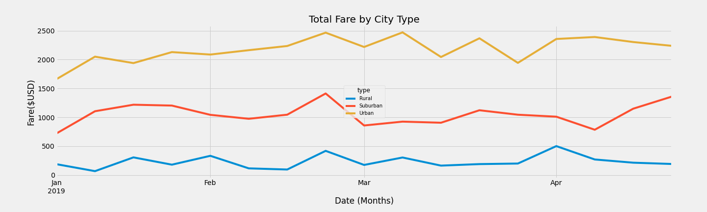
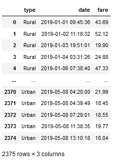
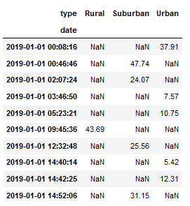

# PyBer Analysis Remport
Resources used: Python, pandas, Jupyter Notebook, MatPlotLib, NumPy, and SciPy
## Overview of the Analysis
This project was given by a ride-sharing company called PyBer. The overall purpose of the project was to analyze the PyBer data to find the average fares per driver and ride, total number of available drivers and rides, and more. All of the analysis was sorted into "bins" based on the city type. The three different city types in this study were rural, suburban, and urban cities. Throughout the project, I was able to compare and contrast the sorted data between the city types to create tables and graphs. My last assignment was to create a summary DataFrame of the ride-sharing data by city type, and then create a multi-line graph to compare the total weekly fares for each city-type.

## Results

The first deliverable in this part of the project was to create the table above, which summarizes PyBer's data by city type. Rural cities had far fewer rides and drivers than suburban and urban cities, but the average fare for each ride was much higher than the other two. Urban cities made much more revenue overall, but had a lower average fare per driver and per ride. While there could be many factors for why this is the case, my theory is that this trend is due to population size and the density of both the commercial businesses and housing. This would explain why rural cities, which are usually spread out and have a lower population than suburban and urban cities, have the higher avaerage fares. Drivers in this area are also more likely go get more rides since there is less competition there. By contrast, drivers in urban and suburban cities have a lower average fare  per ride and per driver, but have a higher total fare as city types.

The last part of the project was to create the above line graph, which shows the total weekly fares for each city type from January 1st, 2019 to April 29, 2019. This was a much more challenging deliverable than the table, but was made possible by using the groupby() function, making a pivot table, and resampling the data. (see below). The pivot table helped me change the DataFrame so that the date was now the index. This new table helped me get the total fares for each type of city by the date. From there, I transitioned the pivot into a workable DataFrame, and resampled the data to sort it into "bins." The points of data were now sorted by week instead of by day. With the data all cleaned up, I then utilized MatPlotLib to create the graph.

Total Fare Data Frame

 Pivot Table  

 

## Summary
